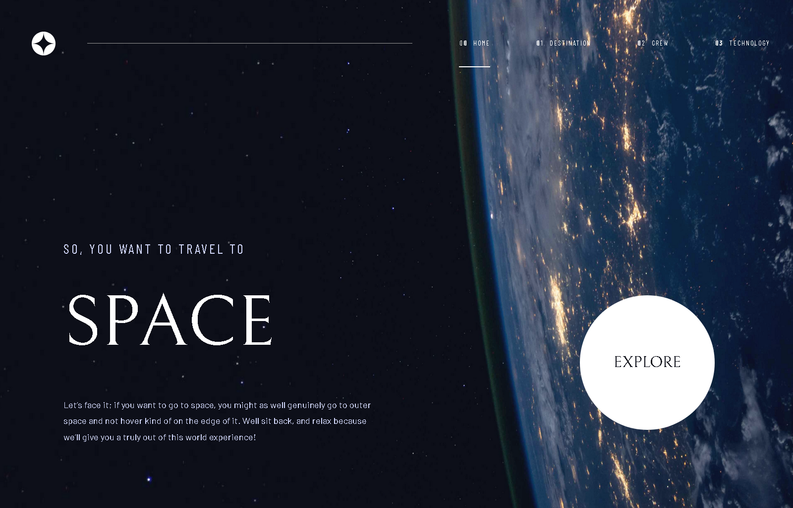

# Frontend Mentor - Space tourism website solution

This is a solution to the [Space tourism website challenge on Frontend Mentor](https://www.frontendmentor.io/challenges/space-tourism-multipage-website-gRWj1URZ3). Frontend Mentor challenges help you improve your coding skills by building realistic projects. 

## Table of contents

- [Overview](#overview)
  - [The challenge](#the-challenge)
  - [Screenshot](#screenshot)
  - [Links](#links)
- [My process](#my-process)
  - [Built with](#built-with)
  - [What I learned](#what-i-learned)
  - [Continued development](#continued-development)
- [Author](#author)
- [Acknowledgments](#acknowledgments)

**Note: Delete this note and update the table of contents based on what sections you keep.**

## Overview

### The challenge

Users should be able to:

- View the optimal layout for each of the website's pages depending on their device's screen size
- See hover states for all interactive elements on the page
- View each page and be able to toggle between the tabs to see new information

### Screenshot



### Links

- Solution URL: [github repo](https://github.com/Abdelwahab121221/space-tourism)
- Live Site URL: [Live Site](https://space-tourism-by-abdelwahab.netlify.app/)

## My process

### Built with

- Semantic HTML5 markup
- CSS custom properties
- Flexbox
- CSS Grid
- Mobile-first workflow
- [React](https://reactjs.org/) - JS library


### What I learned

I learned in this project How to change button elements without navigation to another
page by react useState I think is the best thing I learned in this project and I like figma
sketches it's a powerful tool . 


```js
  const [active, setActive] = useState("moon");
```

```html

```

and when I want to change the photo or text just I setActive the name of photo like it .
```html
<ul>
  <li
    onClick={() => {
      setActive("moon");
    }}
    className={`${
      active === "moon" ? "active" : ""
    } barlow-condensed-regular`}
  >
    moon
  </li>
  <li
    onClick={() => {
      setActive("mars");
    }}
    className={`${
      active === "mars" ? "active" : ""
    } barlow-condensed-regular`}
  >
    mars
  </li>
  <li
    onClick={() => {
      setActive("europa");
    }}
    className={`${
      active === "europa" ? "active" : ""
    } barlow-condensed-regular`}
  >
    europa
  </li>
  <li
    onClick={() => {
      setActive("titan");
    }}
    className={`${
      active === "titan" ? "active" : ""
    } barlow-condensed-regular`}
  >
    titan
  </li>
</ul>
```

### Continued development

I think on the future I can add more features like speed the performance on phones and support more Responsive phones
not supported like iphone SE and Galaxy S8+ .

## Author

- Website - [Abdelwahab Ali](https://www.your-site.com)
- Frontend Mentor - [@yourusername](https://www.frontendmentor.io/profile/yourusername)
- Linkedin - [@yourusername](https://www.twitter.com/yourusername)

## Acknowledgments

One of best tools is the AI I think in near future the AI will be one of best assistants I use in this project chatgpt to explain for me some reasons of problems .